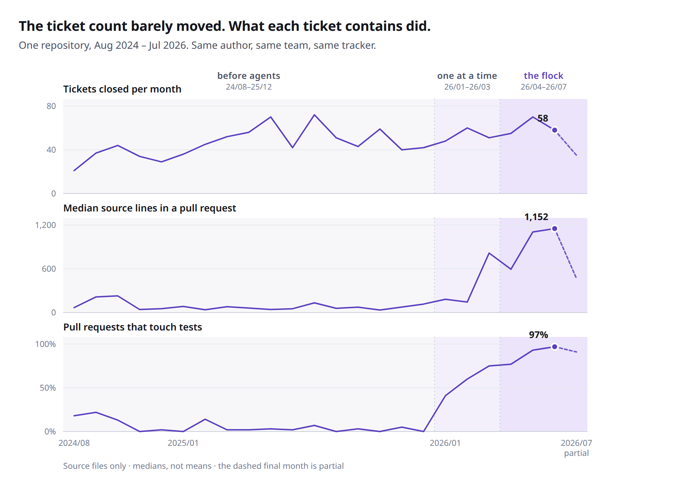
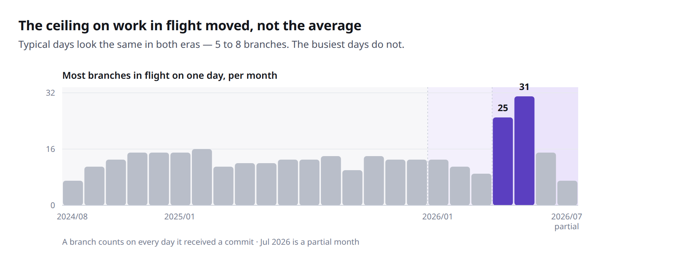

<div align="center">

# 🐦‍⬛ MindFlock

**A private flock of AI coding agents — started by your ticket queue, merged by you.**

[](https://github.com/MindFlock/MindFlock/actions/workflows/ci.yml)
[](https://github.com/MindFlock/MindFlock/releases)
[](LICENSE)
[](pyproject.toml)
[-lightgrey)](#requirements)
[](CONTRIBUTING.md)

[What is it?](#what-is-mindflock) •
[Where your code goes](#where-your-code-goes) •
[Does it actually work?](#what-it-looks-like-in-use) •
[How is this different?](#how-is-this-different) •
[Quick Start](#quick-start) •
[Download](#download) •
[How It Works](#how-it-works) •
[Documentation](#documentation)

</div>

<div align="center">


<sub>A Jira issue assigned to you becomes its own git worktree, installed
environment and seeded agent — with nothing typed — next to four other sessions
that arrived the same way. A recording of the shipped app; the tickets, repo,
diffs and terminal output are sample data.</sub>

</div>

## What is MindFlock?

Work assigned to you in **GitHub Issues, Jira, Linear, Shortcut, or Asana**
becomes an isolated AI coding session **on your own machine**: its own **git
worktree** on its own `feature/<ticket>/<slug>` branch, dependencies installed,
and an agent already seeded with the ticket's title, description, acceptance
criteria and comments. Nothing typed. No vendor sandbox, no account, no copy of
your repository anywhere but your disk — and with a local model, no network
either.

<sub>One caveat worth knowing before you read further: dependency install is
auto-detected for Python/uv repos (`uv sync --all-groups`, `pre-commit install`)
and every other stack declares its own `setup_commands`. Any agent CLI can drive
any session — including the *provisioned* ones ingestion creates, which each
ticketing source picks its own agent for.</sub>

You come in at the end that needs a human: **read the diff**, then drive it home
with one click each — commit (in your terminal, so you watch the hooks), push,
open the PR, merge. Pull requests that come back with review comments become
sessions the same way, on the PR's own branch, with every unresolved inline
review comment in the prompt (outdated threads and top-level PR conversation are
skipped).

**Two ways in, and both are first-class.** The tracker path leads because
nothing else does it — but MindFlock is also, plainly, a parallel-agent
workspace, and plenty of days that is all it is: hit **+ New**, pick a repo and
an agent, type a prompt, and you have another isolated worktree running beside
the rest. Same grid, same live terminals, same Diff tab, same guided
commit → push → PR → merge, same phone UI, same cost tracking. **A tracker is a
source of sessions, not a requirement for them** — and unlike the ingestion path,
a hand-started session runs whichever agent CLI you point it at.

**What is not automatic** — because a pipeline you can't trust is worse than
none. MindFlock never commits, pushes, opens or merges a PR by itself: every one
of those is your click, you write the commit message, and the PR text is filled
in from your commits. It never writes to your tracker — no comments, no status
transitions. It polls (every 20 s) rather than listening for
webhooks, works one ticket at a time, and only picks up review comments on *your
own* PRs.

## Where your code goes

Nowhere new. **MindFlock is not a service.** There is no MindFlock cloud, no
account to create, no sandbox that gets a copy of your repository. The engine is
a process on your laptop bound to `127.0.0.1` by default; the agents are the same
CLIs you already run in a terminal, launched into a git worktree on your own
disk, on your own subscription.

That is the whole difference from the cloud ticket-to-PR tools. Devin, Google
Jules, GitHub Copilot's coding agent, Cursor's background agents and Atlassian
Rovo Dev take the same input — a ticket assigned to you — and clone your
repository into a VM the vendor operates. MindFlock takes the same input and
never moves the code.

Everything MindFlock itself talks to over the network, in full:

| It calls | When | What it sends |
|---|---|---|
| Your tracker's API (GitHub Issues · Jira · Linear · Shortcut · Asana) | every ~20 s while ingestion is on | nothing — **read-only**. It never comments and never moves a status |
| your local model server, if you configure one | every turn of a session on a local model | your prompt and code — to `127.0.0.1` (or whatever host you pointed it at). Never leaves your machine unless you aim it off-box |
| `api.github.com` | polling *your own* PRs for review comments; the **Make PR** / **Merge** buttons | what `gh` would send if you ran it by hand |
| `aipricing.guru` | at most once a day, for the model price table behind the cost display | nothing. Falls back to a built-in table offline |
| your git remote | only when *you* click push | your commits, over the remote your repo already has |
| `ntfy.sh`, or your own instance | only if you switch phone push on | the notification text |
| GitHub Releases | the desktop app's update check | nothing |

No analytics, no telemetry, no crash reporting, no license check, no phone-home
of any kind — the tree is public, so grep it. Tracker tokens live in
`~/.mindflock/settings.json` at mode `0600` and are sent to the tracker they
belong to and nowhere else. `mindflock serve` refuses the network until you
explicitly ask for `tailscale` mode, and even then it's your tailnet behind an
auth token, never the public internet.

**The honest boundary, because it's the first thing a security review will
ask:** your *agent* still talks to its own vendor. `claude` sends code to
Anthropic and `codex` sends it to OpenAI, exactly as they do when you run them
yourself in that repo — MindFlock adds no hop and introduces no third party, but
by default it does not remove that one either.

**If that call is the one you can't make, close it.** Settings → **Local model**
points the session's CLI at a model you serve yourself — Ollama, LM Studio, or
any OpenAI-compatible server — and then there is no code egress at all: no
subscription, no API key, and nothing you type or edit crosses the network.
Supported by `codex`, `aider` and `goose`, each of which has native local-model
support, and it applies to *ingested* sessions too, so a ticket can go from
assigned to committed without leaving the machine. `claude` speaks only the
Anthropic API, so it has no local route — the screen and `mindflock doctor` both
say so rather than letting a session quietly keep using it.

## What it looks like in use

Running a flock does not get you more tickets. It changes what fits inside one.

<picture>
  <source media="(prefers-color-scheme: dark)" srcset="docs/img/fig1-what-changed-dark.png">
  
</picture>

**6.3× more reviewed source code per half-hour at the keyboard** — at the same
ticket cadence, with tests on nine changes in ten instead of one in twenty. One
developer's own repository, 2,210 merged pull requests, recomputed from git and the
Shortcut API rather than estimated.

|  | before agents<br><sub>2024-07 → 2025-12</sub> | agents, one at a time<br><sub>2026-01 → 03</sub> | **the flock**<br><sub>2026-04 → 07</sub> |
|---|---|---|---|
| Tickets closed per month | 43 | 53 | **55** |
| Median **source lines per ticket** | 114 | 168 | **979** |
| Median source lines per PR | 68 | 210 | **873** |
| Median files per PR | 4 | 7 | **13** |
| Median modules touched per PR | 2 | 2 | **4** |
| PRs that touch tests | 5% | 58% | **88%** |
| Most branches in flight in one day | 16 | 13 | **31** |
| **Reviewed source per engaged half-hour** | 72 | 208 | **453** |

A change that used to be 114 lines across 4 files is now 979 lines across 13, in
twice as many modules. Tests came along for the ride: **5% of pull requests touched
a test before, 88% do now** — which is the number that makes the extra volume worth
having rather than worth worrying about.

### Why the flock, and not just an agent

Adopting one agent roughly tripled the size of a typical change. Going from one
agent to a flock multiplied it by **four again on top of that** — the second step is
the bigger one. This is why:

<picture>
  <source media="(prefers-color-scheme: dark)" srcset="docs/img/fig3-parallelism-dark.png">
  
</picture>

An average day is 5–8 branches in both eras — that never changed. **The ceiling
did**, from 16 to 31. Parallelism is not something you use all day; it is what you
need on the days when six things are half-finished at once, and those are exactly
the days that used to cap out. MindFlock is the thing that raised that ceiling: one
grid, one worktree per session, deterministic per-agent state, and the next git step
always one button away.

<sub>Honest edges, because they make the rest checkable: this is **not** faster
wall-clock ticket cycle time — Shortcut's start→done clock is longer, since it
measures review, QA and deploy queues that no coding tool touches. And it is not
free: 13.5 B tokens went through agents on this machine over 46 logged days, and
engaged windows per month rose by half.</sub>

<details>
<summary>Method — so you can check it</summary>

- **Source-only.** Lockfiles, generated and minified files, images, CSVs,
  notebooks, `dist/`, `vendor/`, `node_modules/` and DB dumps are excluded. They
  are under 1% of the lines in the recent period and 2.6% in the older one, so
  they are not what moved.
- **Medians, not means.** A handful of bulk-import PRs (one month has 1.6 M lines
  in a single batch) dominate any average; medians are what a typical change looks
  like. "Reviewed source per engaged half-hour" is PR count × median PR size ÷
  engaged windows, so one giant import cannot inflate it.
- **Diff per PR** = `git diff <base> <branch-tip>` at the merge commit, computed
  from the local clone for all 2,210 merged PRs authored by one person.
- **Engaged half-hour** = a distinct 30-minute window containing at least one
  commit on one of those branches. In the recent period some of those commits are
  an agent's while the human was elsewhere, which *overstates* engaged time and so
  makes the 6.3× a floor.
- **Tickets** = Shortcut stories owned by that person with a `completed_at`.
- **Eras.** Agent-authored commits first appear 2026-02; the ingestion pipeline's
  ancestor lands in the work repo 2026-04-22 and has been running ticket → agent →
  PR in production since 2026-06-22.

</details>

## What MindFlock itself has run

38 days, 2026-06-22 → 2026-07-29, from the pipeline's own dedup state:

| | |
|---|---|
| Tickets provisioned into sessions with nothing typed | **38** |
| Median time from provisioning to a merged pull request | **22 hours** |
| Own pull requests triaged for review comments | **42** — the ones with nothing actionable were skipped automatically; the rest came back as sessions |
| Agent CLIs the pipeline drove | **2** (`claude`, `ccc`) — of 5 driven on this machine overall |

<sub>The ticket figure counts distinct tickets: the dedup state holds 47 records,
of which 7 were throwaway test tickets and 2 were re-runs. Log rotation makes the
PR-session count a floor.</sub>

## How is this different?

Two different families of tools each do half of what MindFlock does, and they
sit on opposite sides of it.

**The ticket-to-PR tools run in someone else's cloud.** Assigning an issue and
getting a pull request back is no longer rare — it's a first-party feature at
GitHub, Google, Atlassian and Linear. What every one of them has in common is
that your repository is checked out on a machine you don't own.

| | ticket → PR | where the agent runs | your repo is cloned to |
|---|---|---|---|
| **MindFlock** | **yes** | **your machine** | **nowhere — it's already there** |
| Devin (Cognition) | yes | vendor sandbox | Cognition |
| Google Jules | yes | vendor VM | Google |
| GitHub Copilot coding agent | yes | GitHub Actions runner | GitHub |
| Cursor background agents | yes | vendor sandbox | Cursor |
| Atlassian Rovo Dev | yes | remote sandbox | Atlassian |

**The local orchestrators make you start every session yourself.** Each one below
is a good way to *start* an AI coding session, and MindFlock is a good way to
start one too — `+ New`, a repo, an agent, a prompt. The difference is that in
MindFlock you don't *have* to: your tracker can do it for you, and it still
happens on your hardware.

| | **MindFlock** | **Claude Squad** | **Conductor** | **Claude Code Agent Teams** |
|---|---|---|---|---|
| **Ticket → session, automatically** | **GitHub Issues · Jira · Linear · Shortcut · Asana** (GitHub Issues needs zero config) | — | — | — |
| **Reviewed PR → session, automatically** | **unresolved inline review comments become the prompt** | — | — | — |
| Git workflow | **one-click commit → push → PR → merge** (plain `git push` over your own SSH/HTTPS remote; `gh` optional for the PR steps) | commit + push branch | per-task diff + review | manual (agent runs git) |
| Agent CLIs | **Any — declared in a TOML file**, including for ingested sessions (per-source choice) | Several, bundled (Claude Code, Codex, Gemini, aider, OpenCode) | Claude Code, Codex, Cursor, OpenCode | Claude only |
| **Runs fully local (no subscription)** | **Ollama · LM Studio · any OpenAI-compatible server** | — | — | — |
| Session isolation | git worktree + tmux | git worktree + tmux | git worktree | git worktree |
| Agent-state detection | **deterministic — provider-defined hooks** (working / idle / needs-input) | inferred from the tmux pane | built-in, per supported agent | Claude-native |
| Interface | Cross-platform desktop app **+ phone UI** | Terminal TUI | Native macOS app | Built into the CLI |
| Platforms | Linux, macOS, Windows (WSL2) | macOS, Linux | macOS only | Anywhere Claude Code runs |
| Remote / phone control | **tailnet + QR, full action bar** | — | — | — |

<sub>Both comparisons are as of July 2026; these tools move fast. If a cell is out of date, please [open an issue or PR](CONTRIBUTING.md) and we'll correct it.</sub>

**Nothing in either table sits where MindFlock does** — the queue starts the
session *and* the session runs on your hardware. Seven local orchestrators were
checked for a personal assigned-ticket poller and none of them has one: the
closest, Conductor, can open a workspace from a GitHub or Linear issue but needs
a click per issue. That is a narrow claim about a fast-moving space rather than a
moat, and it's exactly the kind of cell worth correcting if you find one.

The top two rows of the second table are the ones that matter. Everything else is
a feature race; those two change what your day looks like:

- **Work comes to the agents.** MindFlock polls your tracker for tickets
  assigned to you and GitHub for your PRs that came back with review comments,
  then provisions a worktree and launches a seeded agent for each. The ticket's
  acceptance criteria are mined out of its markdown and handed to the agent; a
  ticket is never worked twice.
- **The whole git loop is guided.** Every session carries a one-click
  commit → push → PR → merge action bar and live workflow-stage badges, so you
  drive the change home without leaving the app. The push is plain `git push`
  over the remote your repo already has — SSH or HTTPS, your choice. When you
  want to keep working on a branch the ladder considers finished, **↺** puts the
  window back to idle so it stops asking — nothing is undone, and it clears
  itself the moment you commit again.
- **Provider-agnostic by design.** A coding agent in MindFlock is just a TOML
  file — binary, launch args, prompt seeding, activity-detection hooks, model
  pricing — so it drives *any* CLI (Claude Code, Codex, Antigravity, aider,
  OpenCode, Cline, Goose, or one nobody's heard of) with the same working / idle /
  needs-input detection and token + cost tracking. Adding an agent is a config
  change, not a patch.
- **Supervise from anywhere.** `mindflock serve tailscale` prints a QR code;
  the mobile UI carries the same guided action bar, so you can unblock an agent
  from your phone.

**When another tool may fit better:**

- **[Conductor](https://www.conductor.build/)** is a native macOS (SwiftUI)
  app — if you're Mac-only and specifically want a native client, it's a solid
  pick.
- **Claude Code's built-in Agent Teams + worktrees** are free and already
  installed. If you only ever use Claude and live in the terminal, you may not
  need a separate app.
- **[Claude Squad](https://github.com/smtg-ai/claude-squad)** is a mature
  multi-agent TUI that also drives several CLIs. If you'd rather stay in the
  terminal than run a desktop app, it's the closer fit.
- **The cloud tools, if you actually want the cloud.** Work continuing while
  your laptop is shut, a fleet running against one backlog, someone else's
  compute paying for the tokens — those are real advantages and MindFlock has
  none of them. It trades all three for the repository never leaving your disk.

## Features

- 🎫 **Ticket & PR-review ingestion** — polls **GitHub Issues, Jira, Linear,
  Shortcut or Asana** (several sources at once, including two of the same
  provider) for work assigned to you, and GitHub for your PRs that came back
  with review comments. Each one gets a worktree, an installed environment and
  an agent seeded with the ticket — title, description, mined acceptance
  criteria, comments. Read-only against your tracker: it never comments or
  moves a ticket's status. **GitHub Issues needs no configuration at all** — the
  token comes from your existing `gh auth login` and the repo from this
  checkout's `origin`.
- 🔒 **No cloud in the middle** — there is no MindFlock service, no account and
  no vendor sandbox holding a copy of your repo. The engine binds `127.0.0.1`
  unless you ask for tailnet mode, ships no analytics or telemetry of any kind,
  and keeps tracker tokens at mode `0600` on your own disk. The one code egress
  is your agent CLI's own call to its vendor — the one you were already making,
  and one you can close entirely by pointing it at a local model.
  [The full network inventory is above](#where-your-code-goes).
- 🔀 **Guided git workflow** — one-click commit → push → PR → merge, with live
  workflow-stage badges
  (provisioning → agent → pre-commit → committed → pushed → PR open). The
  commit runs in the session's own terminal, so you watch the hooks. Pushing is
  plain `git push` over whatever remote you already have — SSH or HTTPS, never
  rewritten by MindFlock. **Make PR** / **Merge** use the `gh` CLI when it's
  installed and authenticated, a GitHub token (Intake → Pull requests) when it
  isn't, and a prefilled compare URL in your browser when you have neither.
- 🔌 **Provider-agnostic** — every coding-agent CLI is just a TOML file (Claude
  Code, Codex, Antigravity, aider, OpenCode, Cline and Goose bundled; add your
  own). That includes **ingested** sessions: each ticketing source picks its own
  agent, so one queue can run on a hosted CLI while another runs on a local
  model. Shared hook-based activity detection (working / idle / needs-input) and
  token & cost tracking apply to all of them.
- 🔒 **Local models — no subscription, nothing leaves the machine** — point
  sessions at a model you serve yourself (**Ollama**, **LM Studio**, or any
  OpenAI-compatible server) and the whole loop runs offline: no API key, and no
  prompt, diff or file crosses the network. Works with codex, aider and goose,
  each of which has native local-model support; Claude Code speaks only the
  Anthropic API, and `mindflock doctor` tells you so rather than letting a
  session quietly use it.
- 🖥️ **Desktop app** (Electron) — a draggable terminal grid with Agent /
  Terminal / Diff / Queue tabs per session, workflow-stage badges, and guided
  next-step buttons, in a window that follows each OS's own chrome conventions
  (native traffic lights on macOS, frameless with our own – □ ✕ elsewhere).
- 📱 **Phone UI** — `mindflock serve tailscale` prints a QR code; the mobile
  UI at `/m` carries the same guided git action bar **and a Diff tab**, so you
  can read the work before approving it and drive the full flow from a phone.
  Auth-token protected — never open to the LAN unauthenticated.
- 🔔 **Notifications where you actually are** — desktop popups while a tab is
  open, and optional **[ntfy](https://ntfy.sh) push to your phone** sent by the
  server, so "session needs your input" or "pre-commit blocked the commit"
  reaches you with MindFlock closed. Off by default; one rule list picks which
  events notify you, and you can point it at your own ntfy instance. Each push
  carries your tailnet phone URL, deep-linked to the session it's about.
- ⏳ **Usage limits ride themselves out** — when an agent runs out of tokens it
  parks on its CLI's limit screen and would sit there long after the window
  reopens. MindFlock notices, tells you, and picks the work back up the moment
  usage returns — queued prompt or not — then tells you that too.
- 🌳 **Isolated workspaces** — every session gets its own git worktree, so
  agents never step on each other (or on you).
- ⚡ **Terminal-first, too** — the `mindflock` CLI drives the same sessions as
  the app (`new`, `ls`, `attach`, `rm`, `open`, `events`), so terminal and UI
  stay one system.
- 🧩 **Extensible** — shell hooks on every session event, a `WS /api/events`
  stream, in-process Python + ES-module addons, and **extensions**: an addon
  that declares a sidebar bar, palette commands and dialog/grid windows in a
  manifest and renders their bodies itself, dropped into
  `~/.mindflock/extensions/` and toggled in Settings. The bundled **Database
  Client** (SQLite / PostgreSQL / MySQL explorer, editable grid, SQL pad) is
  the first.

## Quick Start

[Install first](#download) — one command — then pick the half you came for.

### Let your tracker start the sessions

On a fresh install you connect a tracker in the desktop app's top bar under
**Intake → Tickets** (Alt+I) — **+ Add ticketing source** takes a token, plus the
repo that source's tickets should land in — and flip that tab's **Automated
ingestion** switch; the sidebar's **Ticket Ingestion** bar flips it too. From
then on MindFlock polls for tickets assigned to you and turns each one into a
real session: an isolated git worktree on its own `feature/…` branch with the
agent already seeded with the ticket, appearing in the session grid within
seconds, carrying its stage badge and the guided
commit → push → PR → merge bar.

There is nothing else to install or configure — no config file, no extra
service, and it behaves the same headless. The switch is the on/off control and
it remembers across restarts, so ingestion is never a surprise. It polls rather
than listening for webhooks, so expect a ticket to take up to ~20 s to show up.
Review sessions additionally leave a pull request alone until the PR itself is at
least 15 minutes old — a branch you just pushed doesn't get jumped on.

Prefer a file to a dialog? [`config.toml.example`](config.toml.example) is the
headless equivalent, and `python -m backend.ticket_ingestion` runs the pipeline
standalone — see [docs/ingestion-pipeline.md](docs/ingestion-pipeline.md).

### Or start them yourself — no tracker required

From zero to a supervised agent session (this CLI flow is verified in CI on
every push by
[`scripts/quickstart-verify.sh`](scripts/quickstart-verify.sh)):

```bash
mindflock doctor                       # 1. everything installed + authenticated?
cd ~/code/your-repo                    # 2. the repo you want the agents to work on
mindflock serve                        # 3. start the server (the app can also do this for you)
mindflock new . -p "fix the failing tests"   # 4. (new terminal) spawn a session
mindflock ls                           # 5. watch it: TITLE REPO STATUS ACTIVITY STAGE DIFF COST
```

Open the **MindFlock desktop app** — the session is a live terminal; each one
is an isolated git worktree, with Diff view and guided
commit → push → PR → merge buttons. `mindflock attach <title>` drops your
terminal into the same tmux session.

`mindflock serve` binds localhost only; run `mindflock serve tailscale` to opt
into phone/tailnet access — an auth token + QR code are printed, and scanning
the QR opens the phone UI at `/m`.

## Download

<div align="center">

[-0078D6?style=for-the-badge&logo=windows&logoColor=white)](https://github.com/MindFlock/MindFlock/releases/latest/download/MindFlock-Setup.exe)
[](https://github.com/MindFlock/MindFlock/releases/latest/download/MindFlock.dmg)
[](https://github.com/MindFlock/MindFlock/releases/latest/download/MindFlock.AppImage)

<sub>Each button downloads the newest release · [all versions, checksums, and the Python wheel](https://github.com/MindFlock/MindFlock/releases)</sub>

</div>

| | What you get | Anything else? |
|---|---|---|
| **Windows** | `MindFlock-Setup.exe` — the app **and** the engine (which runs inside WSL2). | **Set up WSL2 first — see the note below.** With a working WSL2 distro in place, the installer does the rest. |
| **macOS** | `MindFlock.dmg` (universal — Apple silicon & Intel). Drag to Applications. | Nothing. First launch offers **Install the engine** — one click, no terminal. |
| **Linux** | `MindFlock.AppImage`. `chmod +x` it and run. | Same — first launch installs the engine for you. |

The app auto-starts the engine every time after that — no terminal, no manual
steps. If the engine is missing, the app's waiting page says so and shows the
exact command.

<details>
<summary><b>⚠️ Windows: finish setting up WSL2 <i>before</i> you run the installer</b></summary>

The engine runs inside WSL2, so a Linux distribution must be **fully installed
and launchable first** — not just `wsl --install` half-run. In PowerShell:

```powershell
wsl --install     # if WSL isn't set up yet — then REBOOT your PC
wsl -l -v         # verify a distro (e.g. Ubuntu) is listed
wsl               # verify this drops you into a Linux shell (first run asks you to create a user), then type: exit
```

Only once `wsl` opens a Linux shell should you run `MindFlock-Setup.exe`. A
**partially set-up WSL** — installed but with no distro, or with a reboot still
pending — is the single most common Windows install failure.

</details>

<details>
<summary>These builds aren't from a paid developer account — what you'll see on first launch</summary>

MindFlock has no Apple Developer ID or Windows Authenticode certificate (both
are paid, per-year subscriptions). The macOS build *is* signed, but with a
free self-signed certificate — enough to keep macOS from re-asking for folder
permission on every launch, not enough to satisfy Gatekeeper. So on first
launch:

**macOS — "Apple could not verify MindFlock is free of malware."**

That dialog has no **Open** button, and the old Control-click → **Open**
shortcut was removed in macOS Sequoia. To open it anyway (you only do this
once):

1. Drag **MindFlock** into your **Applications** folder and try to open it. The
   warning appears — click **Done** to dismiss it.
2. Open the  menu → **System Settings…** → **Privacy & Security**.
3. Scroll down to the **Security** section. You'll see a line like
   *"MindFlock was blocked to protect your Mac."* with an **Open Anyway**
   button next to it. Click it.
4. Confirm with **Open Anyway** again and authenticate with Touch ID or your
   password. MindFlock launches, and macOS remembers the choice — you won't be
   asked again.

Prefer the terminal? This does the same thing in one line:

```sh
xattr -dr com.apple.quarantine /Applications/MindFlock.app
```

The **first time** MindFlock reads a folder under Documents, Desktop,
Downloads, or an external drive, macOS asks *"MindFlock would like to access
files…"* — click **Allow**. Because the app is signed, that grant sticks; it
won't ask again for that folder.

- **Windows** — SmartScreen's "Windows protected your PC". Click **More
  info** → **Run anyway**.
- **Linux** — no prompt; AppImages aren't signed by convention.

Every release ships a `.sha256` beside each installer (and `SHA256SUMS` for
the Python artifacts), and the builds are produced in public by
[the Release workflow](.github/workflows/release.yml) straight from the tag —
so you can check both the bytes and what produced them.

</details>

## Installation

Most people want the [download buttons above](#download). This section is the
same thing spelled out, plus every other way in.

Two pieces: the **server/CLI** (runs the engine) and the **desktop app**
(the one client, Electron — [electron/README.md](electron/README.md)). On
Windows the `.exe` installs both; elsewhere it's two commands.

### 1. Server + CLI

On Linux, macOS, or inside WSL on Windows (the Windows installer runs this for
you, inside your default distro):

```bash
curl -LsSf https://raw.githubusercontent.com/MindFlock/MindFlock/main/install.sh | sh
```

No repo clone, no Python setup needed — the installer brings
[uv](https://docs.astral.sh/uv/) (no root), installs the `mindflock` command,
and finishes with `mindflock doctor` so anything still missing (git, tmux,
`claude`) is listed with the exact install command for your platform.

> **Note on `curl | sh`:** it isn't a blind one — the uv installer it fetches
> is version-pinned and sha256-verified before it runs, and the requested
> branch/tag is resolved to a full commit SHA that is printed and pinned for
> the install, an audit trail for what actually ran. Threat model and
> disclosure contact: [SECURITY.md](SECURITY.md).

<details>
<summary>Prefer your own tooling? (uv / pipx / from source)</summary>

```bash
# uv
uv tool install "mindflock[web] @ git+https://github.com/MindFlock/MindFlock"

# pipx
pipx install "mindflock[web] @ git+https://github.com/MindFlock/MindFlock"

# from a clone (contributors)
git clone https://github.com/MindFlock/MindFlock
cd MindFlock
uv sync --group web
```

</details>

### 2. Desktop app

Use the [download buttons](#download), grab any past build from
[Releases](https://github.com/MindFlock/MindFlock/releases), or build it
yourself:

```bash
cd electron && npm install && npm run dist
```

It finds — and auto-starts — the server by itself.

### Requirements

| Requirement | Notes |
|---|---|
| **OS** | Linux, macOS (Apple silicon & Intel), Windows **via WSL2** (the app runs natively on Windows; the engine lives in WSL2 — native Windows has no tmux/PTYs) |
| `git` ≥ 2.17, `tmux` ≥ 2.4 | On `PATH`; checked, with versions, by `mindflock doctor` |
| A coding-agent CLI | `claude` (Claude Code) by default |
| A git remote you can already push to | **SSH or HTTPS — either works.** MindFlock pushes with plain `git push` over the remote your repo already has, verbatim, and never rewrites it. If `git push` works in your terminal, it works here |
| Optional — `gh` (GitHub CLI) | Only makes **Make PR** / **Merge** one click. Without it they fall back to a GitHub token (Intake → Pull requests), and without a token to a prefilled compare URL you open in your browser. Never involved in pushing. The PR-review poller runs on the same token and treats `gh auth token` as just one place to find it |
| Optional — everything else | `cursor` (IDE integration), `tailscale` (phone access) |

## How It Works

```
  Jira · Linear · GitHub Issues · Shortcut · Asana ──┐
  your own PRs that came back with review comments ──┴──►  ingestion pipeline
                                                           poll · filter · dedup
                                                                    │
                                                                    ▼
                                                        ┌───────────────────────┐
                                                        │    session engine     │
                                                        │  git worktree+branch  │
                                                        │  deps · seeded agent  │
                                                        └───────────────────────┘
                                                                    │
             desktop app (Electron) · phone UI at /m  ◄──────────────┤
                          │                     FastAPI (backend.web)
                          ▼
        you read the diff ──►  commit → push → PR → merge   (one click each)
                                                    │
                                                    ▼
                                              pull request
```

| Component | Package | What it does |
|---|---|---|
| **Session engine** | `backend.session`, `backend.config`, `backend.cmd`, `backend.log` | Instance lifecycle (start/pause/resume/kill), git worktree management, tmux/PTY plumbing, persisted state in `~/.mindflock/`. |
| **Server + UI** | `backend.web` | FastAPI server + the UI the desktop app renders: draggable terminal grid, Agent/Terminal/Diff/Queue tabs per session, workflow-stage badges with guided next-step buttons, token/cost usage, IDE integration, phone UI at `/m`, addon framework. |
| **Ingestion pipeline** | `backend.ticket_ingestion` | Polls your ticketing service (GitHub Issues, Jira, Linear, Shortcut, Asana) for assigned work and GitHub for reviewed PRs; validates, provisions a workspace, and launches a seeded agent session per ticket / per PR — on whichever agent CLI that source is configured for. |
| **Provider framework** | `backend.providers` | Pluggable coding-agent CLIs (Claude built in; aider/codex and others bundled; add your own via TOML). Shared hooks-based activity detection, local-model routing, model pricing, and rolling token/cost usage history. |

Something not working? Run `mindflock doctor` and check
[TROUBLESHOOTING.md](TROUBLESHOOTING.md) — it's indexed by the exact error
text the tool prints.

## Usage

### Running the server

The desktop app auto-starts the server when it isn't running; these commands
are for headless/manual use:

```bash
mindflock serve              # localhost only (127.0.0.1) — the default
mindflock serve tailscale    # bind 0.0.0.0: tailnet mobile URL + QR + auth token
mindflock serve --port 9000  # custom port (default 8765)
```

Run `mindflock serve` from inside the git repository you want to manage — the
startup banner prints which repo that is (and warns if it's the MindFlock
checkout itself). `mindflock doctor` (also served at `GET /api/doctor`) checks
every dependency and prints a platform-appropriate fix for anything missing.

In the app, **+ New** creates a session (worktree + tmux + agent); click a
session to type into its live terminal. Next to it in the top bar, **Intake**
(Alt+I) is the surface you visit to see what came in — tickets, pull requests
and issues — and start any of it by hand. The phone UI lives at `/m` (scan the
startup QR).

### Terminal session control

With a server running, the same sessions can be driven straight from any
terminal — the CLI talks to the server's API (auto-discovered on port 8765, or
`--host`/`--port` / `MINDFLOCK_HOST`/`MINDFLOCK_PORT`):

```bash
mindflock new                    # session on the current repo (title = basename)
mindflock new ~/code/webapp -p "fix the failing tests"
mindflock ls                     # TITLE REPO STATUS ACTIVITY STAGE DIFF COST (--json for scripts)
mindflock attach webapp          # tmux attach to the agent's terminal (prefix ok; needs a real TTY)
mindflock rm webapp --yes        # end a session, keep its worktree (prompts without --yes)
mindflock open webapp            # open the workspace in the configured IDE
mindflock events --follow        # live event stream (great for hook debugging)
```

See [docs/cli.md](docs/cli.md) for the full command reference.

### Ticket-ingestion pipeline

Configure it from the app's **Intake** dialog (top bar, Alt+I), whose Tickets /
Pull requests / Issues tabs save to `~/.mindflock/settings.json` (mode
`0600`, never committed). No file editing needed. Add as many sources as you
like, including two of the same provider (two Jira sites, say), each with its
own credentials and target repo. Then flip the sidebar's **Ticket Ingestion**
switch; it stays off across restarts until you do, and stays on after.

```bash
python -m backend.ticket_ingestion  # run from the repo root
```

For headless/scripted runs you can instead use a `config.toml` (an optional
advanced override): copy [`config.toml.example`](config.toml.example) to
`config.toml` and fill in your values. Every field resolves through
`env var → ~/.mindflock/settings.json → config.toml → default`, so the
web UI, an environment variable, or the file all work.

Or toggle it from the web UI sidebar (**Ticket Ingestion** bar), which runs
it as a managed subprocess and tails its log. The pipeline is a singleton per
directory (`.mindflock-pipeline.lock`); a second copy exits cleanly.

### Notifications & phone push (ntfy)

Settings → **Notifications** holds one rule list — *What triggers a
notification* (needs-input, PR approved, PR merged/closed, budget exceeded,
pre-commit failed, out of usage / usage back, plus quieter opt-ins such as
changes-requested and the verification-plan rules) — and two channels it
feeds:

- **Browser / desktop** popups, which need a tab open on a secure origin
  (HTTPS or localhost).
- **Phone push via [ntfy](https://ntfy.sh)** — off until you turn it on. The
  *server* publishes to a topic your phone subscribes to, so an alert reaches
  you with MindFlock closed and no tab anywhere.

The quietest of the opt-ins is **"a session finishes its work"**, and it means
it. It does not fire when the chip goes grey — a coding CLI reports a turn ended
at the end of *every* reply, so that would buzz once per exchange. MindFlock
sends it only once it has watched that agent actually work — corroborated by
the CLI's own hooks or its status line, not just a CPU blip — seen it stay
idle since (12–45 seconds, shorter the stronger the evidence), and confirmed
nothing is queued to wake it back up: once per stretch of real work, however
long the session then sits there.

To set it up: install the free ntfy app, then in Settings → Notifications →
**Phone push (ntfy)** hit **Generate** for a random topic, scan the QR into the
app, and **Send a test**. Point **Server** at your own ntfy instance to keep
session titles off the public one.

**Every push carries your phone URL.** When Tailscale is up, MindFlock appends
its tailnet `/m` address to each notification and makes it the tap target —
deep-linked to the session the alert is about, so "alpha needs your input"
opens the mobile UI already showing alpha. You also get one push with that URL
whenever it becomes newly reachable: at server start, when you switch the ntfy
channel on, and when you turn on tailscale mode. The access token is never
included (it would be stored on the ntfy server) — a device that has not
scanned the QR before lands on the sign-in page, which the message says.
*Tapping opens* stays available for pointing pushes somewhere else entirely.

> On the public `ntfy.sh` server **the topic name is the credential** — anyone
> who knows it can read your session titles or send you fakes. Keep the
> generated random name, or self-host.

Headless boxes have no Settings screen, so the same channel configures from the
environment — exporting `MINDFLOCK_NTFY_TOPIC` is an implicit opt-in:

```bash
export MINDFLOCK_NTFY_TOPIC=mindflock-xTPq…      # implicit opt-in
export MINDFLOCK_NTFY_SERVER=https://ntfy.example  # optional: your own instance
export MINDFLOCK_NTFY_TOKEN=tk_…                   # optional: protected topic
```

See [docs/web-ui.md](docs/web-ui.md#notifications-) for the full screen guide
(including how to diagnose a push that doesn't arrive) and
[docs/configuration.md](docs/configuration.md) for every `MINDFLOCK_NTFY_*`
variable and its precedence over the Settings values.

### Extensions & hooks

Every session event (created, status/activity/stage changed, paused, deleted…)
flows through a server-side event bus with four extension seams:

1. **Shell hooks** — drop an executable in `~/.mindflock/hooks/<event>/`
   (env vars + JSON envelope on stdin — e.g. a desktop notification when an
   agent needs input).
2. **WebSocket** — subscribe an external tool to the `WS /api/events` stream.
3. **In-process addons** — a Python `Addon` + an ES module the UI loads
   generically (the bundled **notify** addon is the worked example).
4. **Extensions (Addon API v3)** — an addon that also contributes UI: one
   sidebar bar with buttons, commands in the command palette, and dialog /
   grid-window surfaces it renders, all declared in a manifest the host draws
   without running extension code. Put `extension.py` (+ an optional
   `frontend/`) in `~/.mindflock/extensions/<id>/`, restart, toggle it in
   Settings → Extensions. The bundled **Database Client** is the worked
   example.

See [docs/extensions.md](docs/extensions.md) for the full guide.

## Configuration & state

| Path | Contents |
|---|---|
| `~/.mindflock/` | Engine config + session state (`config.json`, `state.json`, `worktrees/`) **and `settings.json`** (the web Settings store: API keys, repo/ticketing config, provider + platform settings; mode `0600`, never committed) |
| `~/.mindflock-assistant/` | Assistant workspace, provider TOMLs, pricing/usage caches, scroll-speed, exit markers |
| `./config.toml` | Optional advanced override for the pipeline + workspace provisioning (gitignored; superseded by `settings.json` / env vars — see [`config.toml.example`](config.toml.example)) |
| `./state.json` | Pipeline dedup state (processed stories/PRs; **different file** from the engine's `~/.mindflock/state.json`) |
| `./workspaces/` | Provisioned story/PR workspaces, `_base_*` canonical clones, `_testmon_refresher` |
| `./logs/` | `pipeline.log`, `ticket-ingestion.log` |

See [docs/configuration.md](docs/configuration.md) for the full reference.

### Uninstalling

`uv tool uninstall mindflock` removes the venv and the `mindflock` shim, but
not the worktrees MindFlock registered *inside your repositories*, nor the
activity hooks it merged into their `.claude`/`.codex` settings — which keep
firing (and keep re-creating `~/.mindflock-assistant`) after the engine is
gone. Undo those first:

```bash
mindflock uninstall --dry-run   # see exactly what would be removed
mindflock uninstall             # worktrees, hooks, scratch files (keeps settings + history)
mindflock uninstall --purge     # …and delete ~/.mindflock + ~/.mindflock-assistant
uv tool uninstall mindflock     # finally, the engine itself
```

On macOS the desktop app additionally leaves `/Applications/MindFlock.app`,
`~/Library/Application Support/MindFlock`, `~/Library/Logs/MindFlock` and
`~/Library/Preferences/ai.mindflock.desktop.plist`. Full details in
[docs/cli.md](docs/cli.md#mindflock-uninstall---purge---keep-worktrees---dry-run---yes).

## Documentation

| Doc | Contents |
|---|---|
| [docs/architecture.md](docs/architecture.md) | System overview, components, data flow, on-disk state map |
| [docs/extensions.md](docs/extensions.md) | Extension guide: shell hooks, `/api/events` WebSocket, in-process addons, extensions (Addon API v3: manifest, `ExtensionApi`, surfaces, discovery, the Database Client), `window.mindflock` client API |
| [docs/configuration.md](docs/configuration.md) | `config.toml` reference, `~/.mindflock/` + `~/.mindflock-assistant/`, environment variables |
| [docs/session-engine.md](docs/session-engine.md) | Instance lifecycle, git worktrees, tmux/PTY, provisioned mode |
| [docs/cli.md](docs/cli.md) | `mindflock` CLI: serve, doctor, uninstall, and terminal session control (new/ls/attach/rm/open/events) |
| [docs/web-api.md](docs/web-api.md) | Complete HTTP + WebSocket API reference |
| [docs/web-ui.md](docs/web-ui.md) | Frontend guide: grid, tabs, stages, shortcuts, mobile, addons |
| [docs/providers.md](docs/providers.md) | Provider framework, adding a CLI via TOML, pricing & usage tracking |
| [docs/accounts.md](docs/accounts.md) | Auth profiles: multiple Claude accounts / OpenRouter keys, per-session identity, hot-swap, per-account usage |
| [docs/ingestion-pipeline.md](docs/ingestion-pipeline.md) | Story + PR ingestion flows, state, testmon refresher |
| [docs/development.md](docs/development.md) | Dev setup, test suite, project layout, known issues |

## Development

```bash
git clone https://github.com/MindFlock/MindFlock
cd MindFlock
uv sync --group web --group dev   # web = FastAPI server deps, dev = pytest
uv run mindflock doctor           # checks git/tmux/agent CLI (+ gh, optional)
uv run mindflock serve            # localhost:8765, from a repo you want to manage
```

Run the test suite (unit + property-based [hypothesis] + integration):

```bash
uv run pytest
```

See [docs/development.md](docs/development.md) for the full test map and
project layout.

## Contributing

Contributions are welcome — bug reports, docs fixes, and code alike. Please
read [CONTRIBUTING.md](CONTRIBUTING.md) first. There's no CLA to sign: just
add a `Signed-off-by` line to your commits with `git commit -s`, certifying
you wrote the patch under the
[Developer Certificate of Origin](https://developercertificate.org/).

> **Project status — solo maintainer.** MindFlock is built and maintained by one
> person in evenings and weekends. It is offered as-is under Apache-2.0; issues
> and pull requests are read and reviewed on a best-effort basis, and there is no
> support SLA. Bug reports (with `mindflock doctor` output) and PRs are very
> welcome — just expect a hobby-project response time.

- 🐛 [Report a bug](https://github.com/MindFlock/MindFlock/issues)
- 💡 [Request a feature](https://github.com/MindFlock/MindFlock/issues)
- 🔒 [Report a security issue](SECURITY.md)

If MindFlock is useful to you, a ⭐ helps other people find it.

## License

Licensed under the [Apache License 2.0](LICENSE) — free and open source.

The **MindFlock** name and logo are trademarks; a license to the code is not a
license to the marks. See [TRADEMARKS.md](TRADEMARKS.md) for the trademark
policy.
