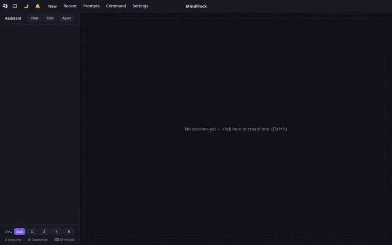

<div align="center">

# 🐦‍⬛ MindFlock

**Run a flock of AI coding agents — each in its own git worktree and tmux
session — supervised from one desktop app.**

[](https://github.com/MindFlock/MindFlock/actions/workflows/ci.yml)
[](https://github.com/MindFlock/MindFlock/releases)
[](LICENSE)
[](pyproject.toml)
[-lightgrey)](#requirements)
[](CONTRIBUTING.md)

[Download](#download) •
[Installation](#installation) •
[Quick Start](#quick-start) •
[How It Works](#how-it-works) •
[Documentation](#documentation) •
[Contributing](#contributing)

</div>

<div align="center">



<sub>Spawn a session → watch the agent work → run a flock in parallel → review the Diff → commit in one click → pick your provider.</sub>

</div>

> **Project status — solo maintainer.** MindFlock is built and maintained by one
> person in evenings and weekends. It is offered as-is under Apache-2.0; issues
> and pull requests are read and reviewed on a best-effort basis, and there is no
> support SLA. Bug reports (with `mindflock doctor` output) and PRs are very
> welcome — just expect a hobby-project response time.

---

## Download

<div align="center">

[-0078D6?style=for-the-badge&logo=windows&logoColor=white)](https://github.com/MindFlock/MindFlock/releases/latest/download/MindFlock-Setup.exe)
[](https://github.com/MindFlock/MindFlock/releases/latest/download/MindFlock.dmg)
[](https://github.com/MindFlock/MindFlock/releases/latest/download/MindFlock.AppImage)

<sub>Each button downloads the newest release · [all versions, checksums, and the Python wheel](https://github.com/MindFlock/MindFlock/releases)</sub>

</div>

| | What you get | Anything else? |
|---|---|---|
| **Windows** | `MindFlock-Setup.exe` — the app **and** the engine (which runs inside WSL2). | **Set up WSL2 first — see the note below.** With a working WSL2 distro in place, the installer does the rest. |
| **macOS** | `MindFlock.dmg` (universal — Apple silicon & Intel). Drag to Applications. | Nothing. First launch offers **Install the engine** — one click, no terminal. |
| **Linux** | `MindFlock.AppImage`. `chmod +x` it and run. | Same — first launch installs the engine for you. |

> **⚠️ Windows: finish setting up WSL2 *before* you run the installer.** The
> engine runs inside WSL2, so a Linux distribution must be **fully installed and
> launchable first** — not just `wsl --install` half-run. In PowerShell:
>
> ```powershell
> wsl --install     # if WSL isn't set up yet — then REBOOT your PC
> wsl -l -v         # verify a distro (e.g. Ubuntu) is listed
> wsl               # verify this drops you into a Linux shell (first run asks you to create a user), then type: exit
> ```
>
> Only once `wsl` opens a Linux shell should you run `MindFlock-Setup.exe`. A
> **partially set-up WSL** — installed but with no distro, or with a reboot still
> pending — is the single most common Windows install failure.

The app auto-starts the engine every time after that — no terminal, no manual
steps. If the engine is missing, the app's waiting page says so and shows the
exact command.

<details>
<summary>These builds are unsigned — what you'll see on first launch</summary>

Code-signing certificates are on the roadmap, not in this release. Until then:

- **macOS** — *"Apple could not verify MindFlock is free of malware."* That
  dialog has no **Open** button, and the old Control-click → **Open** bypass
  was removed in macOS Sequoia. Dismiss it, then go to **System Settings →
  Privacy & Security**, scroll to Security, and click **Open Anyway** next to
  MindFlock. From a terminal the equivalent is
  `xattr -dr com.apple.quarantine /Applications/MindFlock.app`.
- **Windows** — SmartScreen's "Windows protected your PC". Click **More
  info** → **Run anyway**.
- **Linux** — no prompt; AppImages aren't signed by convention.

Every release ships a `.sha256` beside each installer (and `SHA256SUMS` for
the Python artifacts), and the builds are produced in public by
[the Release workflow](.github/workflows/release.yml) straight from the tag —
so you can check both the bytes and what produced them.

</details>

## What is MindFlock?

MindFlock turns one repository into a fleet of parallel, isolated AI coding
sessions. Each session is a **git worktree** (or clone) plus a **tmux session**
running a coding agent (Claude Code by default), surfaced in the desktop app
as a live terminal with a guided **commit → push → PR → merge** workflow. An
optional ticket-ingestion pipeline watches Shortcut stories and GitHub PR
reviews and spins up sessions for them automatically.

## Features

- 🖥️ **Desktop app** (Electron) — a draggable terminal grid with Agent /
  Terminal / Diff tabs per session, workflow-stage badges, and guided
  next-step buttons.
- 🌳 **Isolated workspaces** — every session gets its own git worktree, so
  agents never step on each other (or on you).
- 🔀 **Guided git workflow** — one-click commit → push → PR → merge, driven by
  the `gh` CLI.
- 📱 **Phone UI** — `mindflock serve tailscale` prints a QR code; the mobile
  UI at `/m` carries the same guided git action bar, so the full flow drives
  from a phone. Auth-token protected — never open to the LAN unauthenticated.
- 🎫 **Ticket ingestion** — polls Shortcut for assigned stories and GitHub for
  reviewed PRs, then provisions a workspace and launches a seeded agent
  session per story / per PR.
- 🔌 **Pluggable providers** — Claude Code built in; aider/codex and others
  bundled; add any coding-agent CLI via a TOML file. Shared hooks-based
  activity detection (working / idle / needs-input) plus token & cost
  tracking.
- ⚡ **Terminal-first, too** — the `mindflock` CLI drives the same sessions as
  the app (`new`, `ls`, `attach`, `rm`, `open`, `events`), so terminal and UI
  stay one system.
- 🧩 **Extensible** — shell hooks on every session event, a `WS /api/events`
  stream, and in-process Python + ES-module addons.

## Installation

Most people want the [download buttons above](#download). This section is the
same thing spelled out, plus every other way in.

Two pieces: the **server/CLI** (runs the engine) and the **desktop app**
(the one client, Electron — [electron/README.md](electron/README.md)). On
Windows the `.exe` installs both; elsewhere it's two commands.

### 1. Server + CLI

On Linux, macOS, or inside WSL on Windows (the Windows installer runs this for
you, inside your default distro):

```bash
curl -LsSf https://raw.githubusercontent.com/MindFlock/MindFlock/main/install.sh | sh
```

No repo clone, no Python setup needed — the installer brings
[uv](https://docs.astral.sh/uv/) (no root), installs the `mindflock` command,
and finishes with `mindflock doctor` so anything still missing (git, tmux,
`claude`) is listed with the exact install command for your platform.

> **Note on `curl | sh`:** it isn't a blind one — the uv installer it fetches
> is version-pinned and sha256-verified before it runs, and the requested
> branch/tag is resolved to a full commit SHA that is printed and pinned for
> the install, an audit trail for what actually ran. Threat model and
> disclosure contact: [SECURITY.md](SECURITY.md).

<details>
<summary>Prefer your own tooling? (uv / pipx / from source)</summary>

```bash
# uv
uv tool install "mindflock[web] @ git+https://github.com/MindFlock/MindFlock"

# pipx
pipx install "mindflock[web] @ git+https://github.com/MindFlock/MindFlock"

# from a clone (contributors)
git clone https://github.com/MindFlock/MindFlock
cd MindFlock
uv sync --group web
```

</details>

### 2. Desktop app

Use the [download buttons](#download), grab any past build from
[Releases](https://github.com/MindFlock/MindFlock/releases), or build it
yourself:

```bash
cd electron && npm install && npm run dist
```

It finds — and auto-starts — the server by itself.

### Requirements

| Requirement | Notes |
|---|---|
| **OS** | Linux, macOS (Apple silicon & Intel), Windows **via WSL2** (the app runs natively on Windows; the engine lives in WSL2 — native Windows has no tmux/PTYs) |
| `git` ≥ 2.17, `tmux` ≥ 2.4 | On `PATH`; checked, with versions, by `mindflock doctor` |
| A coding-agent CLI | `claude` (Claude Code) by default |
| `gh` (GitHub CLI) | For the push/PR/merge workflow |
| Optional | `cursor` (IDE integration), `tailscale` (phone access) |

## Quick Start

From zero to a supervised agent session (the CLI flow is verified in CI on
every push by [`scripts/quickstart-verify.sh`](scripts/quickstart-verify.sh)):

```bash
mindflock doctor                       # 1. everything installed + authenticated?
cd ~/code/your-repo                    # 2. the repo you want the agents to work on
mindflock serve                        # 3. start the server (the app can also do this for you)
mindflock new . -p "fix the failing tests"   # 4. (new terminal) spawn a session
mindflock ls                           # 5. watch it: TITLE REPO STATUS ACTIVITY STAGE DIFF COST
```

Open the **MindFlock desktop app** — the session is a live terminal; each one
is an isolated git worktree, with Diff view and guided
commit → push → PR → merge buttons. `mindflock attach <title>` drops your
terminal into the same tmux session.

`mindflock serve` binds localhost only; run `mindflock serve tailscale` to opt
into phone/tailnet access — an auth token + QR code are printed, and scanning
the QR opens the phone UI at `/m`.

## How It Works

```
 Shortcut stories ─┐                            ┌─ desktop app (Electron)
 GitHub PR reviews ┴─► ingestion pipeline ─┐    ├─ phone UI at /m (tailnet QR)
                                           ▼    ▼
                                    ┌──────────────────┐
                                    │  session engine  │  git worktrees + tmux
                                    │  (backend.*)     │  + provider launch
                                    └──────────────────┘
                                           ▲
                            FastAPI server (backend.web)
```

| Component | Package | What it does |
|---|---|---|
| **Session engine** | `backend.session`, `backend.config`, `backend.cmd`, `backend.log` | Instance lifecycle (start/pause/resume/kill), git worktree management, tmux/PTY plumbing, persisted state in `~/.mindflock/`. |
| **Server + UI** | `backend.web` | FastAPI server + the UI the desktop app renders: draggable terminal grid, Agent/Terminal/Diff tabs per session, workflow-stage badges with guided next-step buttons, token/cost usage, Cursor integration, phone UI at `/m`, addon framework. |
| **Ingestion pipeline** | `backend.ticket_ingestion` | Polls Shortcut for assigned stories and GitHub for reviewed PRs; validates, provisions a workspace, and launches a seeded Claude session per story / per PR. |
| **Provider framework** | `backend.providers` | Pluggable coding-agent CLIs (Claude built in; aider/codex and others bundled; add your own via TOML). Shared hooks-based activity detection, model pricing, and rolling token/cost usage history. |

Something not working? Run `mindflock doctor` and check
[TROUBLESHOOTING.md](TROUBLESHOOTING.md) — it's indexed by the exact error
text the tool prints.

## Usage

### Running the server

The desktop app auto-starts the server when it isn't running; these commands
are for headless/manual use:

```bash
mindflock serve              # localhost only (127.0.0.1) — the default
mindflock serve tailscale    # bind 0.0.0.0: tailnet mobile URL + QR + auth token
mindflock serve --port 9000  # custom port (default 8765)
```

Run `mindflock serve` from inside the git repository you want to manage — the
startup banner prints which repo that is (and warns if it's the MindFlock
checkout itself). `mindflock doctor` (also served at `GET /api/doctor`) checks
every dependency and prints a platform-appropriate fix for anything missing.

In the app, **+ New** creates a session (worktree + tmux + agent); click a
session to type into its live terminal. The phone UI lives at `/m` (scan the
startup QR).

### Terminal session control

With a server running, the same sessions can be driven straight from any
terminal — the CLI talks to the server's API (auto-discovered on port 8765, or
`--host`/`--port` / `MINDFLOCK_HOST`/`MINDFLOCK_PORT`):

```bash
mindflock new                    # session on the current repo (title = basename)
mindflock new ~/code/webapp -p "fix the failing tests"
mindflock ls                     # TITLE REPO STATUS ACTIVITY STAGE DIFF COST (--json for scripts)
mindflock attach webapp          # tmux attach to the agent's terminal (prefix ok; needs a real TTY)
mindflock rm webapp --yes        # end a session, keep its worktree (prompts without --yes)
mindflock open webapp            # open the workspace in the configured IDE
mindflock events --follow        # live event stream (great for hook debugging)
```

See [docs/cli.md](docs/cli.md) for the full command reference.

### Ticket-ingestion pipeline

Configure it from the web UI's ⚙ **Settings** dialog (Ticketing / Repository /
GitHub sections) — values are saved to `~/.mindflock/settings.json` (mode
`0600`, never committed). No file editing needed.

```bash
python -m backend.ticket_ingestion  # run from the repo root
```

For headless/scripted runs you can instead use a `config.toml` (an optional
advanced override): copy [`config.toml.example`](config.toml.example) to
`config.toml` and fill in your values. Every field resolves through
`env var → ~/.mindflock/settings.json → config.toml → default`, so the
Settings UI, an environment variable, or the file all work.

Or toggle it from the web UI sidebar (**Ticket Ingestion** bar), which runs
it as a managed subprocess and tails its log. The pipeline is a singleton per
directory (`.mindflock-pipeline.lock`); a second copy exits cleanly.

### Extensions & hooks

Every session event (created, status/activity/stage changed, paused, deleted…)
flows through a server-side event bus with three extension seams:

1. **Shell hooks** — drop an executable in `~/.mindflock/hooks/<event>/`
   (env vars + JSON envelope on stdin — e.g. a desktop notification when an
   agent needs input).
2. **WebSocket** — subscribe an external tool to the `WS /api/events` stream.
3. **In-process addons** — a Python `Addon` + an ES module the UI loads
   generically (the bundled **notify** addon is the worked example).

See [docs/extensions.md](docs/extensions.md) for the full guide.

## Configuration & state

| Path | Contents |
|---|---|
| `~/.mindflock/` | Engine config + session state (`config.json`, `state.json`, `worktrees/`) **and `settings.json`** (the web Settings store: API keys, repo/ticketing config, provider + platform settings; mode `0600`, never committed) |
| `~/.mindflock-assistant/` | Assistant workspace, provider TOMLs, pricing/usage caches, scroll-speed, exit markers |
| `./config.toml` | Optional advanced override for the pipeline + workspace provisioning (gitignored; superseded by `settings.json` / env vars — see [`config.toml.example`](config.toml.example)) |
| `./state.json` | Pipeline dedup state (processed stories/PRs; **different file** from the engine's `~/.mindflock/state.json`) |
| `./workspaces/` | Provisioned story/PR workspaces, `_base_*` canonical clones, `_testmon_refresher` |
| `./logs/` | `pipeline.log`, `ticket-ingestion.log` |

See [docs/configuration.md](docs/configuration.md) for the full reference.

### Uninstalling

`uv tool uninstall mindflock` removes the venv and the `mindflock` shim, but
not the worktrees MindFlock registered *inside your repositories*, nor the
activity hooks it merged into their `.claude`/`.codex` settings — which keep
firing (and keep re-creating `~/.mindflock-assistant`) after the engine is
gone. Undo those first:

```bash
mindflock uninstall --dry-run   # see exactly what would be removed
mindflock uninstall             # worktrees, hooks, scratch files (keeps settings + history)
mindflock uninstall --purge     # …and delete ~/.mindflock + ~/.mindflock-assistant
uv tool uninstall mindflock     # finally, the engine itself
```

On macOS the desktop app additionally leaves `/Applications/MindFlock.app`,
`~/Library/Application Support/MindFlock`, `~/Library/Logs/MindFlock` and
`~/Library/Preferences/ai.mindflock.desktop.plist`. Full details in
[docs/cli.md](docs/cli.md#mindflock-uninstall---purge---keep-worktrees---dry-run---yes).

## Documentation

| Doc | Contents |
|---|---|
| [docs/architecture.md](docs/architecture.md) | System overview, components, data flow, on-disk state map |
| [docs/extensions.md](docs/extensions.md) | Extension guide: shell hooks, `/api/events` WebSocket, in-process addons, `window.mindflock` client API |
| [docs/configuration.md](docs/configuration.md) | `config.toml` reference, `~/.mindflock/` + `~/.mindflock-assistant/`, environment variables |
| [docs/session-engine.md](docs/session-engine.md) | Instance lifecycle, git worktrees, tmux/PTY, provisioned mode |
| [docs/cli.md](docs/cli.md) | `mindflock` CLI: serve, doctor, uninstall, and terminal session control (new/ls/attach/rm/open/events) |
| [docs/web-api.md](docs/web-api.md) | Complete HTTP + WebSocket API reference |
| [docs/web-ui.md](docs/web-ui.md) | Frontend guide: grid, tabs, stages, shortcuts, mobile, addons |
| [docs/providers.md](docs/providers.md) | Provider framework, adding a CLI via TOML, pricing & usage tracking |
| [docs/ingestion-pipeline.md](docs/ingestion-pipeline.md) | Story + PR ingestion flows, state, testmon refresher |
| [docs/development.md](docs/development.md) | Dev setup, test suite, project layout, known issues |

## Development

```bash
git clone https://github.com/MindFlock/MindFlock
cd MindFlock
uv sync --group web --group dev   # web = FastAPI server deps, dev = pytest
uv run mindflock doctor           # checks git/tmux/gh/agent CLI
uv run mindflock serve            # localhost:8765, from a repo you want to manage
```

Run the test suite (unit + property-based [hypothesis] + integration):

```bash
uv run pytest
```

See [docs/development.md](docs/development.md) for the full test map and
project layout.

## Contributing

Contributions are welcome — bug reports, docs fixes, and code alike. Please
read [CONTRIBUTING.md](CONTRIBUTING.md) first; a one-time
[CLA](CLA.md) signature is requested automatically on your first PR.

- 🐛 [Report a bug](https://github.com/MindFlock/MindFlock/issues)
- 💡 [Request a feature](https://github.com/MindFlock/MindFlock/issues)
- 🔒 [Report a security issue](SECURITY.md)

## License

Licensed under the [Apache License 2.0](LICENSE) — free and open source.

The **MindFlock** name and logo are trademarks; a license to the code is not a
license to the marks. See [TRADEMARKS.md](TRADEMARKS.md) for the trademark
policy.
